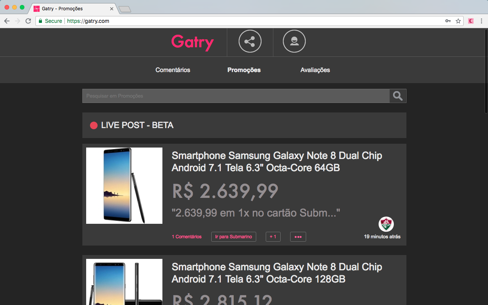
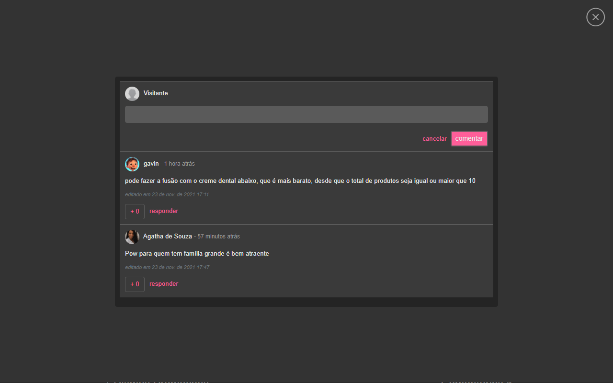

# Gatry Modo Noturno

  

## Chrome Store

## Descrição
    Extensão que apaga as luzes do Gatry, economizando o dinheiro do óculos de sol para navegar no site para gastar com alguma promoção.

## Capturas de Telas
<picture>

 
<label>Tela de promoções com o modo noturno ligado</label>
</picture>
  

<picture>

 
<label>Exemplo da tela de Avaliações</label>
</picture>
  

<picture>

 
<label>Comente no site sem precisar de óculos de sol</label>
</picture>

## Mais informações
- Website: www.moraisandre.com
- Twitter: <a href="https://twitter.com/moraisandre">@moraisandre</a>